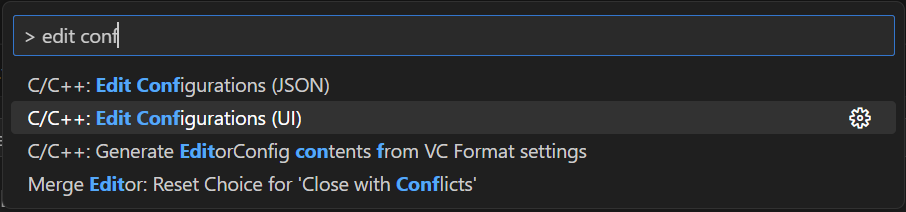
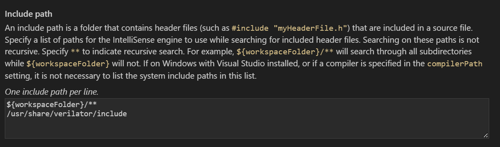
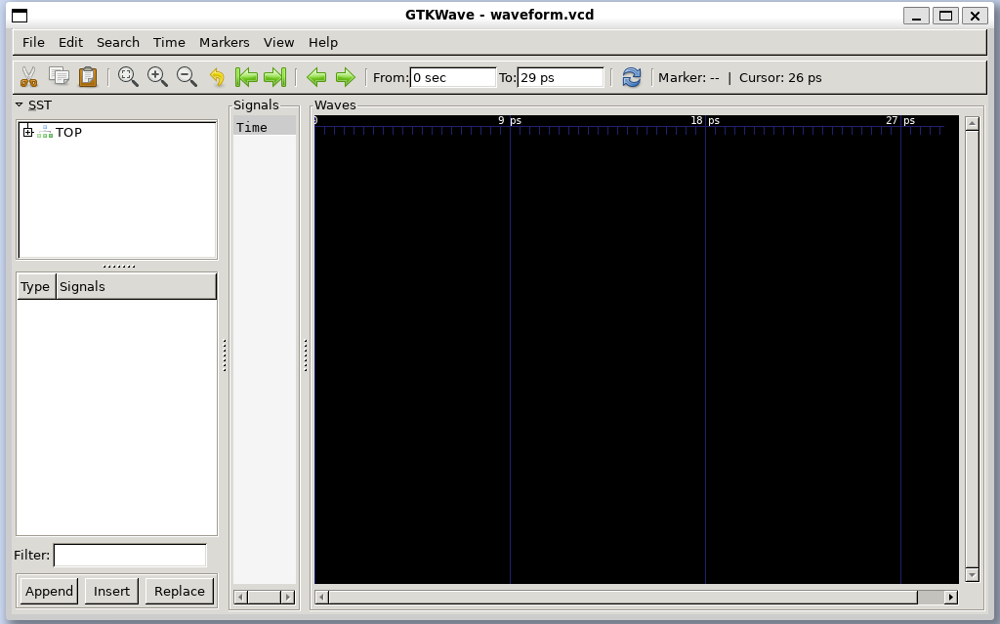
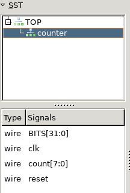
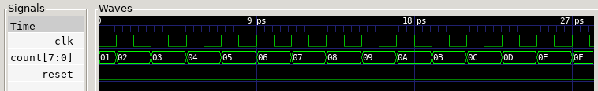

# What is Verilator?

Verilator is a free, open-source tool for converting Verilog and SystemVerilog code to a cycle-accurate C++ model. This model is a software equivalent to the hardware RTL code, allowing us to run testbenches written in C++ to simulate the behavior of our circuit. Using a software model is a different approach to simulating compared to traditional testbenches used in simulators like Xilinx Xsim, which, like the hardware RTL, would also be written in an RTL itself.

Simulating with Verilator has several advantages:

- The simulation only needs to update each signal when there is a change to it, rather than every timestep. This means that simulations run *much* faster.
- We have the full power of C++ available to us. Though waveforms are definitely useful, we can also port our data into more powerful programs analyze the data, including even a [VGA simulator](../VGA_Simulator/README.md)!
- It can be used to analyze [code coverage](../Extras/README.md#Code-coverage), showing you what parts of your HDL are most commonly used (if at all!). This is a great process for determining where you should place your focus when trying to improve the performance of a circuit.

Unfortunately, this does not come without downsides. The two main ones are:

- Only synthesizable Verilog can be simulated, or in other words, Verilog that can actually be turned into hardware. This means that delay statements like `#10` and similar software-only constructs will not work.
- Verilator is a two-state simulator. Many traditional simulators, such as the one in Xilinx Vivado, are 4-state. Both, of course, support 0 and 1 states for each bit, but only the latter supports unknown (X) and high-impedance (Z) states.

## Installation

We'll need to install both Verilator and GTKWave, an open-source waveform viewer. Exact installation steps will depend on your operating system.

### Linux

Linux operating systems have the best support for these tools. The easiest way to get them is with your package manager.

```sh
sudo apt install verilator gtkwave
```

### MacOS

Verilator and GTKWave support macOS, but I haven't tested them myself there. If you'd like to try using Verilator natively on macOS, you can install the Homebrew package manager to then install Verilator and GTKWave:

```sh
/bin/bash -c "$(curl -fsSL https://raw.githubusercontent.com/Homebrew/install/HEAD/install.sh)"
brew install verilator
brew install --cask gtkwave
```

Alternatively, you can install an Ubuntu or other Linux virtual machine for better support.

### Windows

The easiest way to get started on Windows is with Windows Subsystem for Linux (WSL). On Windows 11, the installation is as easy as opening a PowerShell as administrator and running:

```powershell
wsl --install -d Ubuntu
```

You'll then be prompted to restart your PC, after which you can access the VM by searching for "Ubuntu", or by opening it as a new tab in the "Terminal" application, where it should automatically be added as a dropdown option. You may need to restart the Terminal for this to appear.

From here, you can follow the Linux instructions.

### Visual Studio Code

I will also be including instructions to integrate Verilator into Visual Studio Code, a popular code editor. I'd recommend installing this directly from [their website](https://code.visualstudio.com/) for more frequent updates than a package manager.

If you are using WSL, you can install VSCode on Windows and add the [WSL extension](https://marketplace.visualstudio.com/items?itemName=ms-vscode-remote.remote-wsl). From there, you can run `code <file.txt>` in WSL on any file you wish to edit to launch a connection from WSL to the VSCode instance on Windows. The first time you do this, it will automatically install the required package in your WSL distribution.

#### Configuration

For an optimal coding experience, install the [C/C++ extension](https://marketplace.visualstudio.com/items?itemName=ms-vscode.cpptools). Then, so that we can see Verilator constructs and functions in IntelliSense, add the Verilator header to the extension's include path:

1. Open the Command Palette by pressing Ctrl+Shift+P
2. Begin searching for "Edit Configurations" until you can click the following option:

   

Add Verilator to the "Include path". If you installed Verilator with `apt`, you will want to add the following directory:

```sh
/usr/share/verilator/include
```

If you followed the Git Quick Install instructions to build from source, you will instead want to add:

```sh
/usr/local/share/verilator/include
```

Your setting should now look something like this:



## Our First Verilated Module

### The HDL

As a simple example, let's begin with a simple counter. Below is the SystemVerilog code for the module.

```Verilog
module counter #(
    parameter BITS = 8) (
    input clk,
    input reset,
    output logic [BITS-1:0] count
    );

    always_ff @ (posedge clk) begin
        if (reset)
            count <= 0;
        else
            count <= count + 1;
    end
endmodule
```

### C++ Testbench

Now for the actual Verilator part. I will include my full testbench below, then deep-dive into what each part is doing.

```cpp
#include <stdlib.h>
#include <iostream>
#include <verilated.h>
#include <verilated_vcd_c.h>
#include "obj_dir/Vcounter.h"

int main(int argc, char** argv, char** env){
    // Initialize verilated module
    Vcounter *dut = new Vcounter;

    // Trace setup
    Verilated::traceEverOn(true); // enables trace output
    VerilatedVcdC *vcd = new VerilatedVcdC; // manages trace file
    dut->trace(vcd,5);
    vcd->open("waveform.vcd");
    int i = 0; // the timestep we are currently on

    // Initialize inputs
    dut->clk = 0;
    dut->reset = 1;

    // Reset
    dut->eval();
    vcd->dump(i);

    dut->reset = 0;
    dut->clk = 1;
    i++;
    dut->eval();
    vcd->dump(i);

    // Run simulation
    while(dut->count <= 0xF) {
        printf("Count: %i\n", dut->count);

        dut->clk = 0;
        i++;
        dut->eval();
        vcd->dump(i);
        

        dut->clk = 1;
        i++;
        dut->eval();
        vcd->dump(i);
    }

    dut->final();

    // Cleanup
    vcd->close();
    delete dut;
    exit(EXIT_SUCCESS);
}
```

#### Headers

```cpp
#include <stdlib.h>
#include <iostream>
#include <verilated.h>
#include <verilated_vcd_c.h>
#include "obj_dir/Vcounter.h"
```

- `stdlib.h` and `iostream` are standard C++ libraries for general functions and input-output operations
- `verilated.h` is the standard Verilator header
- `verilated_vcd_c.h` is an additional Verilator header required to output VCD trace files
- `Vcounter.h` is the header for our C++ model which Verilator will create from our Verilog module
  - `counter` should be replaced with whatever the name of your module is

#### Verilator Setup

```cpp
// Initialize verilated module
Vcounter *dut = new Vcounter;
```

First, we create an object that will act as our DUT (device under test), or in other words, the module we are simulating. The `Vcounter.h` defines a `Vcounter` class that has all the inputs and outputs of our hardware module. `dut` is a pointer to an object of this class.

```cpp
// Trace setup
Verilated::traceEverOn(true); // enables trace output
VerilatedVcdC *vcd = new VerilatedVcdC; // manages trace file
dut->trace(vcd,5);
vcd->open("waveform.vcd");
```

`traceEverOn` is used to enable VCD trace writing, and `vcd` points to an object which handles writing to the trace file. A VCD trace is a file containing the waveforms of the signals in the hardware, which is usually shown to you when running a simulation. The function `trace(vcd,5)` associates our trace data to the module, with `5` being the maximum signal depth, or number of modules deep from the top module, that will be recorded. We open `waveform.vcd`, the actual file that the trace data will be written to.

```cpp
int i = 0; // the timestep we are currently on
```

In a Verilog testbench, it is common to use delay statements to create a clock signal, which is then used to drive the timing of the DUT. We'll still need to create the same clock signals, but we don't have the luxury of hardware parallelism that exists in RTL. Instead of creating an `always` block which runs this clock independently, we'll need to keep track of what timestep we are on, stored here as `i`, and update the clocks accordingly. Similarly, we will also use this to update our VCD file. Each increase in the timestep, or increment of `i`, can be though of as a `#1` delay being performed in a Verilog testbench.

#### Initialization

```cpp
// Initialize inputs
dut->clk = 0;
dut->reset = 1;
```

We want to set the values our inputs start at, so that we can ensure the same simulation behavior every time. More on this will come later.

#### Reset

Similarly, we want to start with a known state for all our internal signals by resetting our module.

```cpp
// Reset
dut->eval();
vcd->dump(i);

dut->reset = 0;
dut->clk = 1;
i++;
dut->eval();
vcd->dump(i);
```

Because we initialized `reset` high, our module enters reset immediately. The state of our module, `dut` is evaluated with `eval()`, and we dump this information into `vcd`, recording it at timestep `i` (which is currently 0) with `dump(i)`.

At the next clock edge, we set `reset` low and `clk` high. `i` is then incremented, so that the next `dump()` will save to the next timestep.

#### Simulation

```cpp
// Run simulation
while(dut->count <= 0xF) {
    printf("Count: %i\n", dut->count);

    dut->clk = 0;
    dut->eval();
    vcd->dump(i);
    i++;

    dut->clk = 1;
    dut->eval();
    vcd->dump(i);
    i++;
}

dut->final();
```

The fun part! This simulation is running until our `count` output hits `0xF`, or 15. Each clock cycle, the current cycle is printed to the console.

The `dut->final()` command is run at the end to run any SystemVerilog `final` blocks. Our counter module does not have any, so in this case it won't do anything meaningful.

#### Cleanup

```cpp
// Cleanup
vcd->close();
delete dut;
exit(EXIT_SUCCESS);
```

Finally, we just need to close the VCD file we opened, clear the memory we allocated for `dut`, and exit our program with a successful error code!

### Simulating

There are two steps required to simulate our SystemVerilog code with the C++ testbench we created: we need to "verilate" the RTL, or convert it to a C++ model, and we need to compile the testbench.

This can be done in two separate commands, which will be explained first, or a single one which combines the two. To verilate our RTL, we can run:

```sh
verilator -Wall --trace -cc counter.sv --exe tb.cpp
```

Let's explain each part:

- `-Wall` enables all warnings
- `--trace` enables Verilator to dump our waveform data to a VCD
- `--cc` specifies that we are using C++
- `counter.sv` is the name of our SystemVerilog module
- `--exe` adds our C++ testbench to the Makefile used in the next step
- `tb.cpp` is the name of our testbench

Successfully running this command should result in an `obj_dir` directory being created, which contains the C++ model Verilator generated from our SystemVerilog code.

Next, to compile the testbench, we'll run a Makefile that the previous step created. This essentially just runs GCC, as our testbench is just a regular C++ file.

```sh
make -C obj_dir -f Vcounter.mk Vcounter
```

Thankfully, Verilator lets us combine both of the previous commands into a single one:

```sh
verilator -Wall --trace --exe --build -cc tb.cpp counter.sv
```

This lets us specify both the RTL and testbench files, and the added `--build` argument automatically runs the Makefile to build our testbench.

Finally, to run the simulation, we just need to run the aforementioned executable:

```sh
./obj_dir/Vcounter
```

If all went well, you should see counts 1-15 printed to the console, and you should now have a file `waveform.vcd` in the folder you ran this.

## Viewing the Waveform

To open our newly created trace file in GTKWave, run:

```sh
gtkwave waveform.vcd
```

More than likely, it will look something like this:



Don't worry, this is normal! Expand the line labelled "TOP" to see our module, and click on each line to see what signals are visible at each level.



To view a signal, you can double-click it, drag it to the Signals box, or select it and click Insert. You can select multiple signals by holding Ctrl while you click on them, or click on one signal, hold Shift, and click another signal to select all signals between them.



From here, you can use the buttons at the top to zoom in/out or scroll between edges.

Congrats, you've successfully Verilated a module, simulated it, and viewed its signals as a waveform! Next, we will look at [Verilating the OTTER](../OTTER/README.md).

A `Makefile` is provided to automate the steps outlined here, which can be run with the `make` command in this directory.
