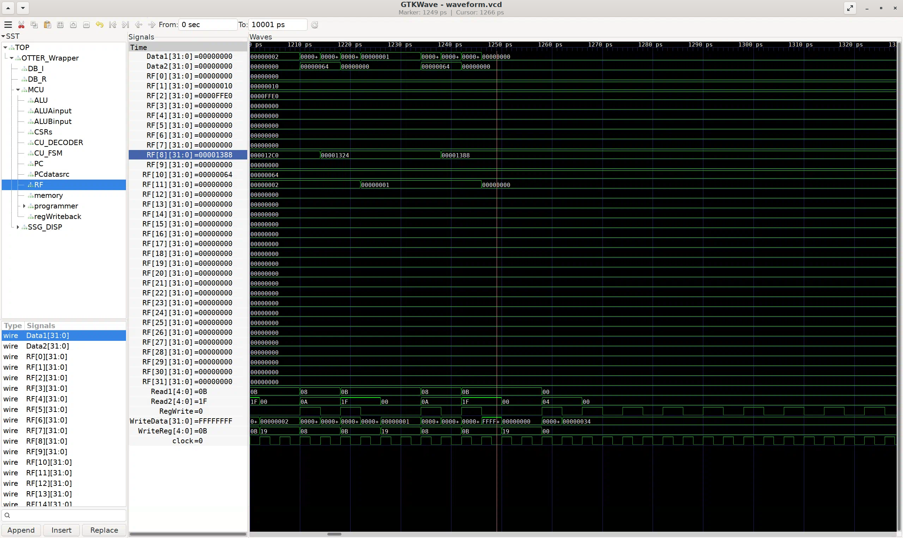
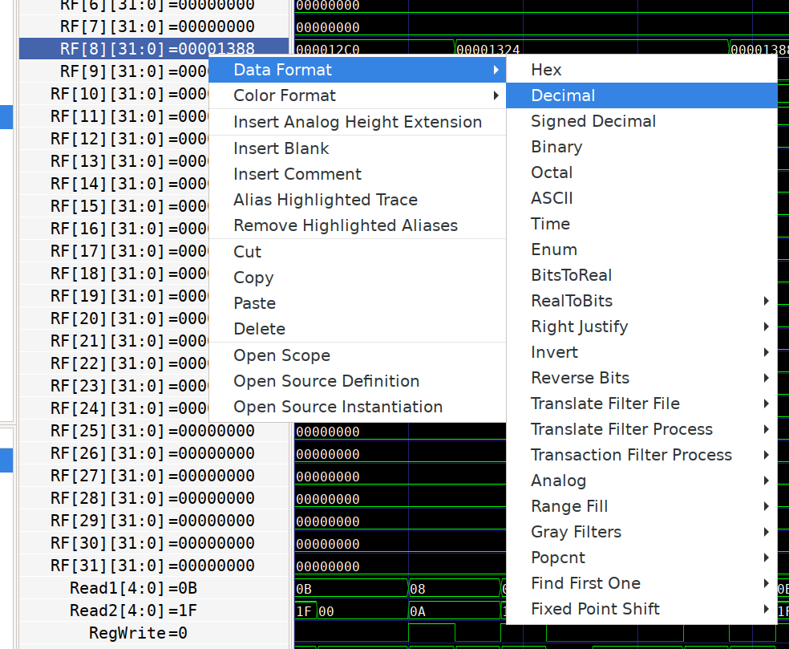
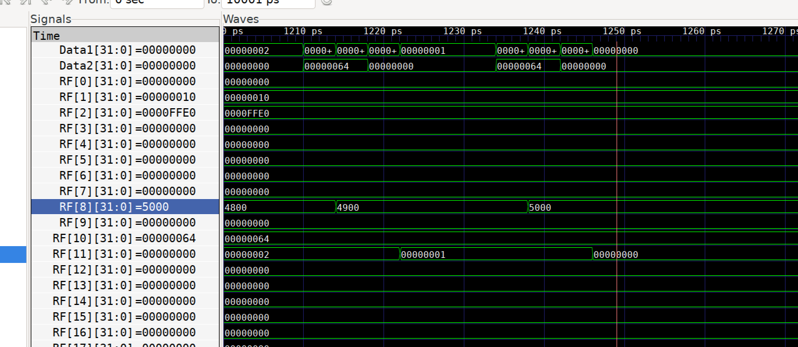

# The OTTER MCU

If you are a Cal Poly student who has taken or is taking CPE 233 or CPE 333, you are definitely familiar with the OTTER MCU. It is a RISC-V processor developed by Dr. Joseph Callenes-Sloan, who tragically passed away in December 2023, to replace the proprietary RAT MCU previously used by these courses. This not only taught students a relevant ISA used in academia and industry, but also modernized the course with support for compilers and open-source tools.

This lesson will go over how to integrate Verilator into the OTTER development process, but also should contain information useful for general designs.

## Verilating

In the [Introduction](/Introduction/README.md) lesson, we Verilated our counter with the following command:

```sh
verilator -Wall --trace --exe --build -cc tb.cpp counter.sv
```

We'll need to make a few changes. Firstly, because our design now includes multiple Verilog/SystemVerilog files, we need to inform Verilator on where to find all of them. This is done with the `-I`, or include, flag. For every directory with Verilog source files, you'll need to add a `-I[directory]` argument. For example, this may look like `-I/home/student/otter -I/home/student/otter/peripherals`.

Verilator expects the module name to matches the file name. In other words, for a SystemVerilog file that begins with `module ControlUnit`, the file should be named `ControlUnit.sv`. For this reason, it is also preferred to keep one module per file.

You'll know that this is causing a problem if you get an error like the following:

```sh
%Error: src/OTTER_Wrapper.sv:79:4: Cannot find file containing module: 'OTTER_MCU'
   79 |    OTTER_MCU MCU (.RESET(s_reset),.INTR(s_interrupt), .CLK(sclk), 
      |    ^~~~~~~~~
```

In this example, it is looking for a module named `OTTER_MCU` but cannot find it because the file is named `OTTER_CPU.sv`. The easiest solution to this is to rename the file. If you want to rename the module instead, make sure to also update any location where it is instantiated.

You may also encounter warnings like the following:

```sh
%Warning-WIDTHEXPAND: src/CU_Decoder.sv:122:38: Operator ASSIGN expects 4 bits on the Assign RHS, but Assign RHS's CONST '3'h3' generates 3 bits.
                                              : ... In instance OTTER_Wrapper.MCU.CU_DECODER
  122 |                     JAL: CU_PCSOURCE = 3'b011;
      |                                      ^
                      src/OTTER_CPU_baseline.sv:179:1: ... note: In file included from OTTER_CPU_baseline.sv
                      src/OTTER_Wrapper.sv:66:1: ... note: In file included from OTTER_Wrapper.sv
```

In `src/CU_Decoder.sv:122:38`, meaning the 38th character of line 122 in `CU_Decoder.sv`, `CU_PCSOURCE` is 4 bits wide, but gets assigned a 3 bit value. To resolve this, the assigned value should be changed to `4'b0011`. These zeros would normally be padded automatically, but this warning makes sure the RTL is clear, and may bring attention to a problem if this wasn't an expected problem.

Even if you don't have any errors caused by your code or file names, you may still encounter something like this:

```sh
%Error: Exiting due to 68 warning(s)
make: *** [Makefile:16: obj_dir/VOTTER_Wrapper] Error 1
```

Of course, the proper solution would be to address each of the warnings. Many of these warnings give important hints to design bugs that may exist. If there is a warning that truly cannot be resolved, there are ways to block off checking for that specific warning in a given block of code.

Realistically, getting rid of every warning every time may not be reasonable, especially for warnings over stylistic choices or for code that has already been thoroughly tested which you do not want to modify. In such cases, adding the `--Wno-fatal` flag to our command will make sure that warnings are not fatal to the verilating process. With this, we have the following Verilator command:

```sh
verilator -Wall --trace --exe --build -cc otter_tb.cpp OTTER_Wrapper.sv --Wno-fatal -I[source_directory]
```

As before, we then just need to run the resulting executable:

```sh
./obj_dir/VOTTER_Wrapper
```

### Parameterizing the `.mem` file (Optional)

To make testing different programs on the OTTER easier, we can avoid having to change the `.mem` file in the SystemVerilog code for our memory module by turning it into a parameter, and instead specify it as an argument in the `verilator` command.

Verilator can only change top-level parameters, so you'll need to pass this all the way from the memory module to the wrapper. In my OTTER implementation, that meant adding the following line:

```sv
parameter string MEM_FILE = ""
```

in the module definitions of my `bram_dualport.sv`, `OTTER_CPU.sv`, and `OTTER_Wrapper.sv` files. Your file names, of course, may vary. Thinking about the parameter getting set at the top level, this then needs to float back down through each instantiation. My instantiation of `OTTER_CPU` inside `OTTER_Wrapper`, for example, looks like:

```sv
OTTER_CPU #(.MEM_FILE(MEM_FILE)) MCU([signals]);
```

Similarly, the parameter will need to be passed down inside the `MCU` of the `bram_dualport` module instantiation.

With this all done, we can set a value with the `-G` flag in Verilator, in the format `-G<name>=<value>`. Similarly to the `-I` flag, there is so space between the `G` and the parameter name. Putting everything together, this is what our Verilator command should look for a `mul.mem` memory file:

```sh
verilator -Wall --trace --exe --build -cc --Wno-fatal -I./src -GMEM_FILE='"mul.mem"' otter_tb.cpp OTTER_Wrapper.sv
```

If you're paying close attention, there's a good chance you're wondering why there's a combination of single and double quotes around `mul.mem`. We ultimately want `"mul.mem"` to be the exact value set in our SystemVerilog code, but with just a single set of quotes, the shell will parse this and turn it into `mul.mem` as an unquoted string. To avoid this, a second set of single quotes is added. The shell will parse and remove these, leaving the inner set of double quotes intact.

If you're running Verilator with a Makefile, which I'd highly recommend, we can take things *another* step further and set it as an environment variable. In my example [Makefile](./Makefile), I've included these defines:

```make
PROGRAM ?= mul
PARAMS = -GMEM_FILE='"mem/$(PROGRAM).mem"'
```

Because of the `?=` assignment, an existing environment variable will take precedent over this assignment. In the terminal, we can set this environment variable for just our `make` command inline:

```sh
make clean
PROGRAM=mul make
```

As a final note, the parameter must be set here during the Verilating process, not in our own C++ testbench. This is because the Verilated C++ model of our hardware depends on this parameter and cannot be built without it. Getting creative with the Makefile parameterization can still allow you to run different testbenches for different memory files without needing to change any code.

## Example testbench

We can use the same basic structure as before to construct a testbench for the OTTER.

```cpp
#include <stdlib.h>
#include <iostream>
#include <verilated.h>
#include <verilated_vcd_c.h>
#include "obj_dir/VOTTER_Wrapper.h"

using namespace std;

int tick(VOTTER_Wrapper *dut, VerilatedVcdC *vcd, int time){
    dut->CLK = !dut->CLK;
    dut->eval();
    vcd->dump(time);
    return time + 1;
}

int main(int argc, char** argv, char** env){
    // Initialize verilated module
    VOTTER_Wrapper *dut = new VOTTER_Wrapper;

    // Trace setup
    Verilated::traceEverOn(true); // enables trace output
    VerilatedVcdC *vcd = new VerilatedVcdC; // object to hold trace
    dut->trace(vcd,5);
    vcd->open("waveform.vcd");
    int time = 0; // the timestep we are currently on

    // Initialize inputs
    dut->SWITCHES = 0;
    dut->CLK = 0;
    dut->BTNL = 0;

    // Reset
    dut->BTNC = 1; // BTNC is tied to OTTER_MCU's RESET in OTTER_Wrapper
    time = tick(dut, vcd, time);
    time = tick(dut, vcd, time);
    dut->BTNC = 0;

    for (int i = 0; i < 10000; i++) {
        time = tick(dut, vcd, time);
    }

    dut->final();

    // Cleanup
    vcd->close();
    delete dut;
    exit(EXIT_SUCCESS);
}
```

In this example, I created a function `tick()` which toggles the clock and advances to the next timestep. Putting that in a `for` loop lets me easily control how long I want the simulation to run for; in this case, `10000` timesteps, or `5000` complete clock cycles, after the reset.

## Viewing the waveform

After verilating the OTTER and running the testbench, we will have a `.vcd` we can open in GTKWave. Here, I've navigated to the register file (RF) module and opened all of its signals in the waveform viewer via Ctrl+A and Append on the signals pane. Clicking and dragging with your right mouse button will zoom into a selected area of the waveform.



Navigating to the end of the relevant activity, I can see the register containing my multiplied value, but in hexadecimal. To change this, right-click the signal, select Data Format, and the desired format; in this case, Decimal. We can now see that the result is 5000.





## Reading values in the testbench

In addition to manual waveform inspection, we can also check this result in our testbench code. That way we can make changes to our design and see right away if it changed the resulting value.

To access signals below the top-level design file, we'll need to add the following to our testbench header:

```cpp
#include "obj_dir/VOTTER_Wrapper___024root.h"
```

This defines the `rootp` pointer as a member of the design's model, which we'll use to navigate its hierarchy. The name `__024root` is meant to mimic the `$root` scope in SystemVerilog, with `__024` being an escape sequence for `$`.

In SystemVerilog, accessing a specific signal may look something like `OTTER_Wrapper.MCU.RF.WriteData`. To access the same signal in Verilator, we'll access a similarly named signal as a member of `rootp`, except with the `.`s replaced with the string `__DOT__`. Thus, the signal would be
`dut->rootp->OTTER_Wrapper__DOT__MCU__DOT__RF__DOT__WriteData`. The naming is done that way because all the signals are "flattened", or in other words, all directly accessible from `rootp` without needing to traverse more levels of objects.

We can read this and print it to our console after our main simulation loop to inspect the signal's value without opening the waveform. I'll format the output knowing from the waveform that `RF[8]` corresponds to the `s0` register in my assembly code.

```cpp
cout << "Reg s0: " << dut->rootp->OTTER_Wrapper__DOT__MCU__DOT__RF__DOT__RF[8] << endl;
```

Re-verilating and running the testbench now gives me the following output:

```sh
Reg s0: 5000
```

If you wish, this functionality can be extended with `assert` statements to test for a suite of test values automatically to form automated tests for your design.

<!-- # TODO: running unit tests -->