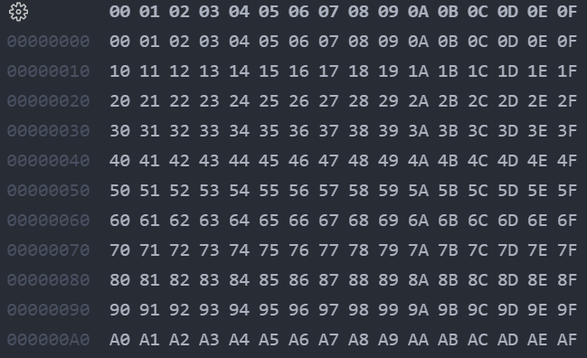
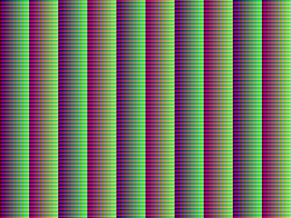

## Adding VGA to the OTTER

Some projects utilizing the OTTER make sure of the VGA port on the Basys3 board. One of the biggest difficulties with this is the difficultly of debugging the video output. Simulating for long enough to get even a single frame takes a very long time, and often won't be very helpful as just a collection of signals. To really verify your code you typically need to go through the full synthesis, implementation, routing, and bitstream flows to load the design onto the FPGA and connect it to a real display.

Using Verilator, we can simply copy the contents of the VGA framebuffer out and process it into an image file. Simulating this way is extremely fast in comparison to Vivado's waveform simulation, and makes it super easy to see the actual image that will be drawn to the display.

## VGA Driver

This tutorial utilizes the 320x240 framebuffer and VGA driver written by former students. See Dr. Andrew Danowitz or another professor teaching CPE 233/333 for a copy of this code. Other implementations written in VHDL may also be available, by Verilator is not currently compatible with that language.

The following files should be added to your project:
- `vga_driver_320x240.sv`
- `vga_fb_driver_320x240.sv`

There may be notes included that use a struct for the MMIO signals. If your design does not follow that signal structure, you can follow the following changes to your wrapper instead.

### Additional output signals

```sv
output [7:0] VGA_RGB,
output VGA_HS,
output VGA_VS
```

### Port IDs

```sv
// INPUT PORT IDS ////////////////////////////////////////////////////////////
localparam VGA_READ_AD  = 32'h11040000;

// OUTPUT PORT IDS ///////////////////////////////////////////////////////////
localparam VGA_ADDR_AD  = 32'h11100000;
localparam VGA_COLOR_AD = 32'h11140000;
```

### Signals

```sv
// Signals for connecting VGA Framebuffer Driver
logic s_vga_we;             // write enable
logic [16:0] r_vga_wa;      // address of framebuffer to read and write
logic [7:0] s_vga_rd;       // pixel color data read from framebuffer
```

### Instantiation

```sv
// Declare VGA Frame Buffer //////////////////////////////////////////////
vga_fb_driver_320x240 VGA(
.CLK(sclk), .WA(r_vga_wa), .WD(IOBUS_out[7:0]), .WE(s_vga_we), .RD(s_vga_rd),
.ROUT(VGA_RGB[7:5]), .GOUT(VGA_RGB[4:2]), .BOUT(VGA_RGB[1:0]), .HS(VGA_HS), .VS(VGA_VS)
);
```

### MMIO Input Port Assignment

This and the following output port assignment should go in their respective `case` statements.

```sv
VGA_READ_AD: IOBUS_in <= {24'h000000, s_vga_rd};  // we can get away with this because the vga read started in the previous cycle or earlier, when the address was set
```

### MMIO Output Port Assignment

```sv
VGA_ADDR_AD: r_vga_wa <= IOBUS_out[16:0]; 
```

### Combinatorial Write Enable Block

```sv
always_comb begin
    s_vga_we = 0;
    if (IOBUS_wr) begin
        case ({IOBUS_addr, 2'b00})
            VGA_COLOR_AD: s_vga_we = 1;
        endcase
    end
end
```

### Constraints

Finally, uncomment the "VGA connector" section of the constraints file and map the appropriate signals to `VGA_RGB`, `VGA_HS`, and `VGA_VS`. The signal `VGA_RGB` is 8 bits in the order `RRRGGGBB`, so the least significant bit of the red and green, and two LSBs of the blue VGA signals can be left commented out.


### Framebuffer memory

In the implementation we are working from, the 128KB framebuffer memory is implemented with a Xilinx IP block. This works in Vivado and is a reliable way to make sure the tools implement the memory in BRAM. Locked IPs such as this, however, are not compatible with Verilator. Instead, we can implement a simple, generic memory with the same port assignments as a drop-in replacement. This is included as [block_mem.sv](./block_mem.sv), and can be used with both Verilator and Vivado.

## Test Pattern Program

A simple assembly program, [vga_color_shift.s](./vga_color_shift.s), is included to test the VGA functionality of our design. This example is assuming a 320x240 display, and as such begins writing at the 76,800th (320 * 240 = 76,800) address of the framebuffer. From there, it writes the last 8 bits of the address value to that address as the color value. This way, as we decrement through the valid addresses, the color will change as well, displaying a neat repeating pattern of 256 pixels in the output.

## Reading Out the Framebuffer

In order to save the contents of the framebuffer, we will implement a similar strategy as before when we read out a register. After running the simulation for a sufficient number of clock cycles ([10,000,000 in my case](./vga_tb.cpp#l115)), we can read the framebuffer.


### Direct Writing

The simplest implementation of this is to directly write the contents out to a file. The color data is stored in 1 byte blocks. There are 17 address bits, resulting in $2^{17} = 131,072 = 128 \times 1024 = 128K$ possible addresses, giving us the 128KB size of the RAM. Similarly, the `fwrite` command here is writing 1 byte from `mem` to the output file $2^{17}$ times.

```cpp
#include <iostream>
...
// Write framebuffer to file
FILE* image = fopen("vga_image.raw", "wb");
int mem_size = 1 << 17;
fwrite(&dut->rootp->vga_wrapper__DOT__VGA__DOT__ram128kx8__DOT__mem, 1, mem_size, image);  // Write 1 byte from mem, mem_size times, to image
fclose(image);
```

> [!WARNING]
> If you are going to be simulating for extended periods of time, it is highly recommended to **disable** waveform writing during simulation. For a simulation running for several million cycles like this will, the trace can become several gigabytes in size. The easiest way to do this is by commenting out the line `vcd->dump(time);` from `tick()`. Alternatively, you can wrap all VCD-related parts of the testbench with a condition which checks an enviromnet variable, which can then be controlled by running our Makefile with `VCD=0 make`. Disabling trace writing will also make the simulation run much faster.

After simulating with this in our testbech, an output file `vga_image.raw` will be created. Because this was just a raw stream of memory values, however, it is not stored in any particular image format, but can be opened in a [hex editor](https://marketplace.visualstudio.com/items?itemName=ms-vscode.hexeditor) to read the color values.



### PNG Image Writing

To make good on our original promise of easily viewing the VGA output, let's convert this data into a more useable format, like PNG. First, we'll need to have the libpng library installed:

```sh
sudo apt install libpng-dev
```

Add `--LDFLAGS -lpng` to the `verilator` command to link the library when it compiles our testbench. Adding to our previous flags, the full command now should be something like:

```sh
verilator -Wall --trace --exe --build -cc --Wno-fatal -Isrc --LDFLAGS -lpng
```

We'll need to add these includes in our testbench:

```cpp
#include <vector>
#include <png.h>
```

Next, we'll create a function to write our data to a PNG. This first part of it is just setting default options for how the file should be written and checking for errors.

```cpp
void write_png(const char* filename, uint8_t* image_data, int width, int height) {
    FILE* fp = fopen(filename, "wb");
    if (!fp) {
        cerr << "File could not be opened for writing\n";
        exit(1);
    }

    // Initialize libpng structures
    png_structp png = png_create_write_struct(PNG_LIBPNG_VER_STRING, nullptr, nullptr, nullptr);
    if (!png) {
        cerr << "png_create_write_struct failed\n";
        exit(1);
    }

    png_infop info = png_create_info_struct(png);
    if (!info) {
        cerr << "png_create_info_struct failed\n";
        exit(1);
    }

    // Set error handling
    if (setjmp(png_jmpbuf(png))) {
        cerr << "Error during png creation\n";
        exit(1);
    }

    // Set the output file for libpng
    png_init_io(png, fp);

    // Write header information for the PNG
    png_set_IHDR(png, info, width, height, 8, PNG_COLOR_TYPE_RGB, PNG_INTERLACE_NONE, PNG_COMPRESSION_TYPE_DEFAULT, PNG_FILTER_TYPE_DEFAULT);
```

The main part of interest is the `for` loop where the actual writing happens. Our framebuffer stores an entire 3-color pixel in 8 bits (R3 G3 B2), but this library expects each color to have at least 8 bits of their own (R8 G8 B8). We can extract each color value out of our pixel and roughly upscale the values by shifting the bits left. Each color is then saved to a vector, containing three entries per pixel.

```cpp
    // Write image data
    png_write_info(png, info);
    for (int y = 0; y < height; y++) {
        // Prepare a row of pixels in 8-bit format (R3 G3 B2 -> R8 G8 B8)
        vector<uint8_t> row(width * 3);  // 3 bytes per pixel (RGB)

        for (int x = 0; x < width; x++) {
            int row_offset = y * width;

            // Convert the RRRGGGBB format to 8-bit RGB
            uint8_t pixel = image_data[row_offset + x];
            uint8_t r = (pixel & 0b11100000);
            uint8_t g = (pixel & 0b00011100) << 3;
            uint8_t b = (pixel & 0b00000011) << 6;

            // Fill the row with the expanded pixel data
            row[x * 3] = r;
            row[x * 3 + 1] = g;
            row[x * 3 + 2] = b;
        }

        png_write_row(png, row.data());
    }

    // End the write process
    png_write_end(png, nullptr);

    // Clean up
    fclose(fp);
    png_destroy_write_struct(&png, &info);
}
```

In the `main` function, after finishing the main simulation loop, we will need to copy the framebuffer's memory to a separate array. Instead of copying the entire array, we can stick to just the relevant entries in our 320x240 image. We were able to avoid this when doing a direct memory read in the prior section, but will need a contiguous array for the individual value reading our function does.

Then, we can pass this array to our function to write the image.

```cpp
int width = 320;
    int height = 240;
    mem_size = width * height;
    uint8_t image_mem[mem_size];

    for (int i = 0; i < mem_size; i++) {
        // Copy data from Verilator object to contiguous array
        image_mem[i] = dut->rootp->vga_wrapper__DOT__VGA__DOT__ram128kx8__DOT__mem[i];
    }
    write_png("output_image.png", image_mem, width, height);
```

If all goes well, you should have the following image saved!


