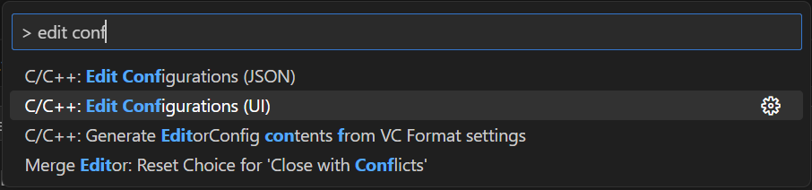
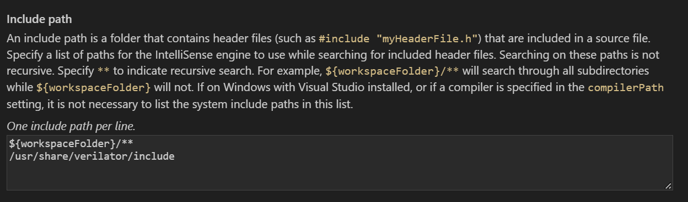
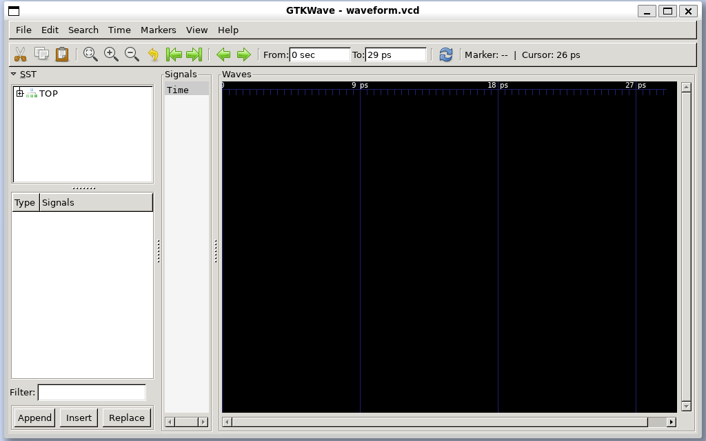
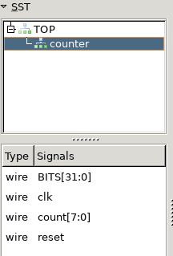
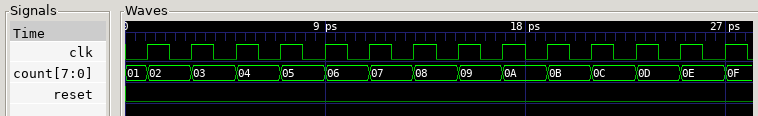

# What is Verilator?

Verilator is a free, open-source tool for converting Verilog and SystemVerilog code to a cycle-accurate C++[^1] model. This model can then be run to simulate the behavior of our circuit. Simulating this way, as opposed to the traditional timestep-based approach directly from HDL in tools such as Xilinx Vivado, has several advantages:

- The simulation only needs to update each signal when there is a change to it, rather than every timestep. This means that simulations run *much* faster.
- We have the full power of C++ available to us. Though waveforms are definitely useful, we can also port our data into any program we can make to analyze the data, including even a [VGA simulator](VGA.md)!
	- Similarly, programming our testbenches in C++ allows us to easily complex scenarios that would be a huge pain to do in (System)Verilog.
- It is easy to analyze [code coverage](Extras.md#Code-coverage), showing you what parts of your HDL are most commonly used (if at all!). This is a great process for determining where you should place your focus when trying to improve the performance of a circuit.

Unfortunately, this does not come without downsides. The two main ones are:

- Only synthesize Verilog can be simulated, or in other words, Verilog that can actually be turned into hardware. This means that delay statements like `#10` and similar software-only constructs will not work.
- Verilator is a two-state simulator. Many traditional simulators, such as the one in Xilinx Vivado, are 4-state. Both, of course, support 0 and 1 states for each bit, but only the latter supports unknown (X) and high-impedance (Z) states.

# Installation

## Operating system preparation

Depending on your operating system, there may be some additional steps required to run Verilator.

### Linux

These instructions assume you are using Ubuntu. If so, you should be able to follow these instructions without any modification.

### MacOS

Verilator supports MacOS, but I personally cannot confirm that these steps will all work as expected. If you'd like to try using Verilator natively on MacOS, you can install the Homebrew package manager by running the following in Terminal:

```sh
/bin/bash -c "$(curl -fsSL https://raw.githubusercontent.com/Homebrew/install/HEAD/install.sh)"
```

From there, you can replace the `apt` installation steps with `brew`. Alternatively, you can install an Ubuntu virtual machine to run these steps in a better supported environment.

### Windows

The easiest way to get started on Windows is with Windows Subsystem for Linux (WSL). As long as you are on Windows 10 version 2004 or greater, or Windows 11, the installation is as easy as opening a PowerShell or Command Prompt as administrator and running:

```powershell
wsl --install -d Ubuntu-24.04
```

You'll then be prompted to restart your PC, after which you can access the VM by searching for "Ubuntu", or by opening it as a new tab in the "Terminal" application, where it should automatically be added as a dropdown option. You may need to restart the Terminal for this to appear.

Ommitting the `-d` flag and running `wsl --install` with default options will, as of the time of writing, install Ubuntu 22.04. This, or other popular distributions, will work but may require additional steps, as outlined in the following step.

## Verilator

For this guide, most versions of Verilator should work fine. Advanced functionality, however, such as using the [Cocotb test framework](Cocotb.md), will require at least version 5.006. You can check [Repology](https://repology.org/project/verilator/versions) to see what version is included in your distribution's package manager. As of writing, Ubuntu 23.04 and above satisfies this requirement, but older versions will require building from source.

If the version included in your distribution's repository satisfies your needs, you can install Verilator with:

```sh
sudo apt install verilator
```

If you are on a distribution which does not have a suitible version of Verilator packaged, follow the [Git Quick Install](https://verilator.org/guide/latest/install.html#git-quick-install) instructions on Verilator's installation page to build from source.

## GTKWave

In addition to Verilator, we will be using GTKWave, an open-source waveform viewer, after running our simulations. Similarly, it can be installed with:

```sh
sudo apt install gtkwave
```

## Visual Studio Code

I will also be including instructions to integrate Verilator into Visual Studio Code, a popular code editor. I'd recommend installing this directly from [their website](https://code.visualstudio.com/) for more frequent updates than a package manager.

If you are using WSL, you can install VSCode on Windows and add the [WSL extension](https://marketplace.visualstudio.com/items?itemName=ms-vscode-remote.remote-wsl). From there, you can run `code <file.txt>` in WSL on any file you wish to edit to launch a connection from WSL to the VSCode instance in Windows. The first time you do this, it will automatically install the required package in your WSL distribution.

### Configuration

For an optimal coding experience, install the [C/C++ extension](https://marketplace.visualstudio.com/items?itemName=ms-vscode.cpptools). Then, so that we can see Verilator constructs and functions in IntelliSense, add the Verilator header to the extension's include path:

1. Open the Command Pallete by pressing Ctrl+Shift+P
2. Begin searching for "Edit Configurations" until you can click the following option:

   

Add Verilator to the "Include path". If you installed Verilator with `apt`, you will want to add the following directory:

```
/usr/share/verilator/include
```

If you followed the Git Quick Install instructions to build from source, you will instead want to add:

```
/usr/local/share/verilator/include
```

Your setting should now look something like this:



# Our First Verilated Module

## The HDL

As a simple example, let's begin with a simple counter. Below is the SystemVerilog code for the module.

```Verilog
module counter #(
    parameter BITS = 8) (
    input clk,
    input reset,
    output logic [BITS-1:0] count
    );

    always_ff @ (posedge clk) begin
        if (reset)
            count <= 0;
        else
            count <= count + 1;
    end
endmodule
```

## C++ Testbench

Now for the actual Verilator part. I will include my full testbench below, then deep-dive into what each part is doing.

```cpp
#include <stdlib.h>
#include <iostream>
#include <verilated.h>
#include <verilated_vcd_c.h>
#include "obj_dir/Vcounter.h"

int main(int argc, char** argv, char** env){
    // Initialize verilated module
    Vcounter *dut = new Vcounter;

    // Trace setup
    Verilated::traceEverOn(true); // enables trace output
    VerilatedVcdC *vcd = new VerilatedVcdC; // manages trace file
    dut->trace(vcd,5);
    vcd->open("waveform.vcd");
    int i = 0; // the timestep we are currently on

    // Initialize inputs
    dut->clk = 0;
    dut->reset = 1;

    // Reset
    dut->eval();
    vcd->dump(i);

    dut->reset = 0;
    dut->clk = 1;
    i++;
    dut->eval();
    vcd->dump(i);

    // Run simulation
    while(dut->count <= 0xF) {
        printf("Count: %i\n", dut->count);

        dut->clk = 0;
        i++;
        dut->eval();
        vcd->dump(i);
        

        dut->clk = 1;
        i++;
        dut->eval();
        vcd->dump(i);
    }

    dut->final();

    // Cleanup
    vcd->close();
    delete dut;
    exit(EXIT_SUCCESS);
}
```

### Headers

```cpp
#include <stdlib.h>
#include <iostream>
#include <verilated.h>
#include <verilated_vcd_c.h>
#include "obj_dir/Vcounter.h"
```

- `stdlib.h` and `iostream` are standard C++ libraries for general functions and input-output operations
- `verilated.h` is the standard Verilator header
- `verilated_vcd_c.h` is an additional Verilator header required to output VCD trace files
- `Vcounter.h` is the header for our C++ model which Verilator will create from our Verilog module
	- `counter` should be replaced with whatever the name of your module is

### Verilator Setup

```cpp
// Initialize verilated module
Vcounter *dut = new Vcounter;
```

First, we create an object that will act as our DUT (device under test), or in other words, the module we are simulating. The `Vcounter.h` defines a `Vcounter` class that has all the inputs and outputs of our hardware module. `dut` is a pointer to an object of this class.

```cpp
// Trace setup
Verilated::traceEverOn(true); // enables trace output
VerilatedVcdC *vcd = new VerilatedVcdC; // manages trace file
dut->trace(vcd,5);
vcd->open("waveform.vcd");
int i = 0; // the timestep we are currently on
```

`traceEverOn` is used to enable VCD trace writing, and `vcd` points to an object which handles writing to the trace file. The function `trace(vcd,5)` associates our trace data to the module, with `5` being the maximum signal depth, or number of modules deep from the top module, that will be recorded. We open `waveform.vcd`, the actual file that the trace data will be written to, and finally, `i` is the current timestep we are on in the simulation. Every time we advance in time, `i` must be incremented appropriately.

### Initialization

```cpp
// Initialize inputs
dut->clk = 0;
dut->reset = 1;
```

We want to set the values our inputs start at, so that we can ensure the same simulation behavior every time. More on this will come later.

### Reset

Similarly, we want to start with a known state for all our internal signals by resetting our module.

```cpp
// Reset
dut->eval();
vcd->dump(i);

dut->reset = 0;
dut->clk = 1;
i++;
dut->eval();
vcd->dump(i);
```

Because we initialized `reset` high, our module enters reset immediately. The state of our module, `dut` is evaluated with `eval()`, and we dump this information into `vcd`, recording it at timestep `i` (which is currently 0) with `dump(i)`.

At the next clock edge, we set `reset` low and `clk` high. `i` is then incremented, so that the next `dump()` will save to the next timestep.

### Simulation

```cpp
// Run simulation
while(dut->count <= 0xF) {
	printf("Count: %i\n", dut->count);

	dut->clk = 0;
	dut->eval();
	vcd->dump(i);
	i++;

	dut->clk = 1;
	dut->eval();
	vcd->dump(i);
	i++;
}

dut->final();
```

The fun part! This simulation is running until our `count` output hits `0xF`, or 15. Each clock cycle, the current cycle is printed to the console.

The `dut->final()` command is ran at the end to run any SystemVerilog `final` blocks. Our counter module does not have any, so in this case it won't do anything meaningful.

### Cleanup

```cpp
// Cleanup
vcd->close();
delete dut;
exit(EXIT_SUCCESS);
```

Finally, we just need to close the VCD file we opened, clear the memory we allocated for `dut`, and exit our program with a successful error code!

## Simulating

To "verilate" our model, run:

```sh
verilator -Wall --trace --exe --build -cc tb.cpp counter.sv
```

Breaking it down:

- `-Wall` enables all warnings
- `--trace` enables Verilator to dump our waveform data to a VCD
- `--exe` links our C++ testbench to the Verilog code
- `--build` automatically builds the new C++ model that Verilator generates
- `--cc` specifies that we are using C++

After those flags, you just need the name of your C++ testbench and the top-level Verilog module. Successfully running this command should result in an `obj_dir` directory being created, which contains the C++ model Verilator generated from our Verilog code and an executable of our simulation.

Finally, to run the simulation, we just need to run the aforementioned executable:

```sh
./obj_dir/Vcounter
```

If all went well, you should see counts 1-15 printed to the console, and you should now have a file `waveform.vcd` in the folder you ran this. 

## Viewing the Waveform

To open our newly created trace file in GTKWave, run:

```sh
gtkwave waveform.vcd
```

More than likely, it will look something like this:



Don't worry, this is normal! Expand the line labelled "TOP" to see our module, and click on each line to see what signals are visible at each level.



To view a signal, you can double click it, drag it to the Signals box, or select it and click Insert. You can select multiple signals by holding Ctrl while you click on them, or click on one signal, hold Shift, and click another signal to select all signals between them.



From here, you can use the buttons at the top to zoom in/out or scroll between edges.

Congrats, you've successfully Verilated a module, simulated it, and viewed its signals as a waveform! Next, we will look at [Verilating the OTTER](OTTER.md).

A `Makefile` is provided to automate the steps outlined here, which can be run with the `make` command in this directory. Part of this file is for generating a PDF of this tutorial and is not related to the Verilation steps.

[^1]: Verilator can also convert to SystemC, but that is outside the scope of these guides.
